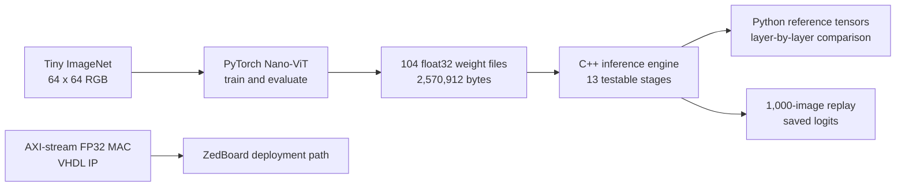
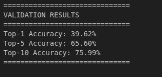
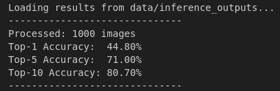
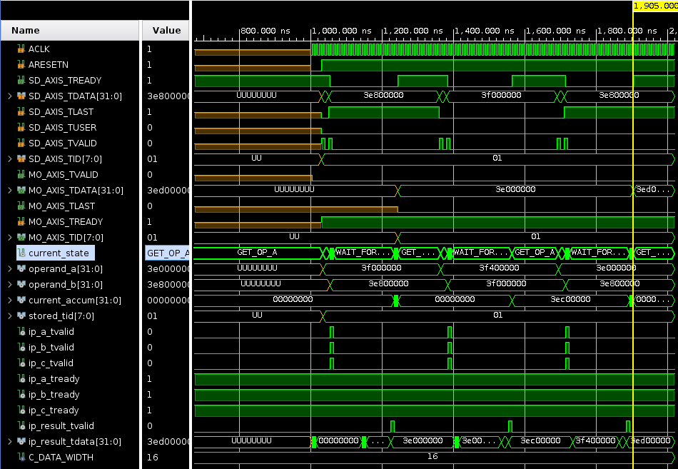
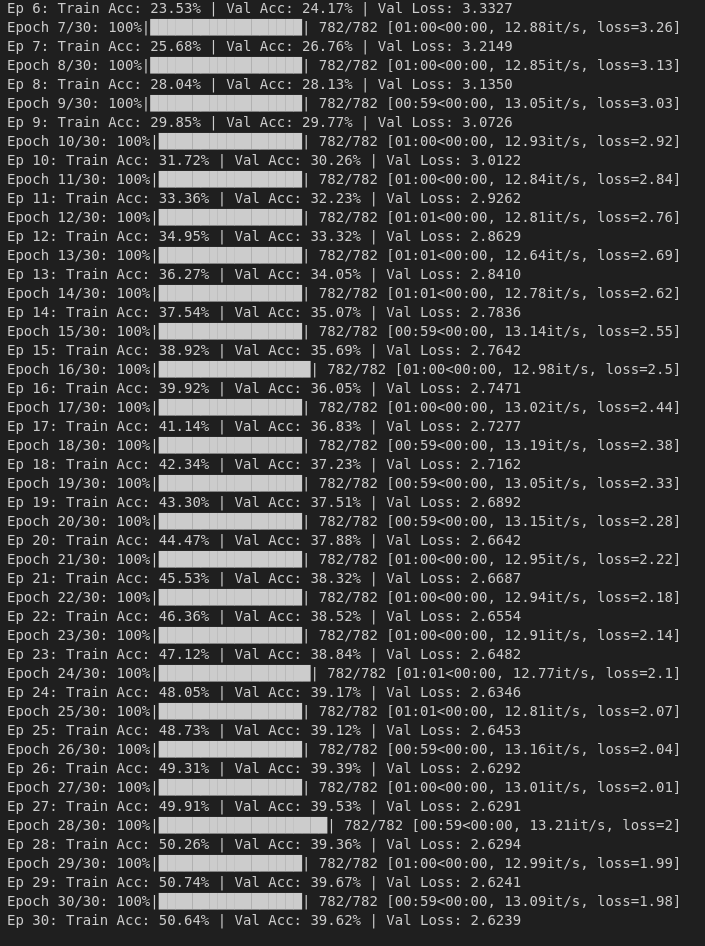

# Nano-ViT on a ZedBoard

### Neural-Network Math and FPGA Inference

This repository is a semester-long hardware/software co-design portfolio. The final project trains a compact Vision Transformer (ViT) for Tiny ImageNet, exports its weights as raw `float32` binaries, reimplements the forward pass in C++, verifies every layer against Python reference tensors, and packages an AXI-stream floating-point multiply-accumulate (MAC) unit for a ZedBoard FPGA workflow.



## Results

| Result | Value | Evidence |
| --- | ---: | --- |
| Nano-ViT parameters | **642,728** | exported weights and PyTorch summary |
| Trainable parameters | **642,728 / 642,728** | PyTorch summary |
| Tiny ImageNet classes | **200** | classifier head |
| Training schedule | **30 epochs**, **782 batches/epoch** | notebook output |
| Peak validation top-1 | **39.67%** at epoch **29** | notebook output |
| Final Python validation | **39.62%** top-1, **65.60%** top-5, **75.99%** top-10 | full validation pass |
| C++ replay evaluation | **44.80%** top-1, **71.00%** top-5, **80.70%** top-10 | 1,000 exported inference results |
| Saved C++ replay corpus | **1,000** inputs + **1,000** output vectors | binary artifacts |
| Python-to-C++ trace depth | **13** stages | patch embed, 8 blocks, norm, token extract, head, softmax |
| Exported parameter files | **104** `float32` blobs, **2.452 MiB** total | `pythonEra/weights/` |

<p align="center">
  
  
</p>

The two accuracy tables measure different saved evaluation runs. They are presented separately rather than treated as interchangeable.

## Model Anatomy

The C++ model builder in [`ML.cpp`](Project_Submission_08/cpp_SW_optimizations/src/ML.cpp) fixes the architecture explicitly:

| Component | Exact shape or count |
| --- | --- |
| Input | `64 x 64 x 3` RGB image |
| Patch projection | `96 x 3 x 8 x 8` weights + `96` biases |
| Patch grid | `8 x 8 = 64` image patches |
| Token sequence | `64` patch tokens + `1` CLS token = **65 tokens** |
| Embedding width | **96** |
| Transformer depth | **8 blocks** |
| Attention heads | **4 heads** |
| Per-head width | `96 / 4 = 24` |
| MLP expansion | `96 -> 192 -> 96` |
| Classifier | `96 -> 200` |
| Final output | **200** softmax probabilities |

Each transformer block performs pre-normalization, combined QKV projection, scaled dot-product attention, output projection, a residual connection, a GELU MLP, and a second residual connection. The optimized implementation adds blocked linear algebra, optional ARM NEON vectorization, four-head threaded attention, and a streaming-attention path that avoids retaining a full score matrix during the active computation.

### Parameter Budget

| Section | Parameters |
| --- | ---: |
| Patch projection, CLS token, positional embedding | 24,864 |
| 8 transformer blocks x 74,784 | 598,272 |
| Final layer normalization | 192 |
| 200-class head | 19,400 |
| **Total** | **642,728** |

For the C++ inference path, the matrix products and attention dot products account for **46,027,008 MACs per image** by direct shape calculation. The PyTorch notebook also reports **1.80M mult-adds** through `torchinfo`; that summary does not expose every transformer-internal operation, so both numbers are kept with their scope stated.

## Implementation

### Python Model

[`pythonEra/`](Project_Submission_08/pythonEra/) contains the model-development and export workflow:

| Notebook | Purpose |
| --- | --- |
| [`ViT_TinyImageNet.ipynb`](Project_Submission_08/pythonEra/ViT_TinyImageNet.ipynb) | dataset preparation, 30-epoch training, evaluation, weight export, and replay scoring |
| [`Multi_Size_ViT.ipynb`](Project_Submission_08/pythonEra/Multi_Size_ViT.ipynb) | capacity experiment across `0.30M`, `0.64M`, `1.25M`, and `5.43M` parameter models |
| [`ViT_Math_Verification.ipynb`](Project_Submission_08/pythonEra/ViT_Math_Verification.ipynb) | manual NumPy forward pass used to validate the exported math |

The model-size experiment is a useful result in its own right: the largest model was not the best model after 30 epochs.

| Variant | Parameters | Top-1 | Top-5 | Top-10 |
| --- | ---: | ---: | ---: | ---: |
| Half size | 0.30M | 35.71% | 62.79% | 73.83% |
| Selected Nano-ViT | 0.64M | **39.62%** | **65.60%** | **75.99%** |
| Double size | 1.25M | 38.59% | 65.20% | 75.62% |
| Large | 5.43M | 33.20% | 57.72% | 67.81% |

### C++ Inference

[`cpp_SW_optimizations/src/`](Project_Submission_08/cpp_SW_optimizations/src/) is the readable software implementation. It contains **22** C++/header files and **2,591** source lines. The model is assembled as 13 individually verifiable stages:

```text
PatchEmbed
  -> TransformerBlock x 8
  -> LayerNorm
  -> TokenExtract(CLS)
  -> Dense(96 -> 200)
  -> Softmax
```

The executable loads exported binary weights, checks every stage against recorded Python output with an epsilon of `0.001`, and runs a 20-pass timing loop when benchmarking is enabled. A separate recorded-test path processes **1,000** binary images and writes **1,000** logit vectors for Python-side scoring.

### FPGA MAC

[`piped_mac.vhd`](Project_Submission_08/hw/fp32_mac/hdl/piped_mac.vhd) wraps a floating-point multiply-accumulate core behind AXI-stream handshakes. Its state machine has **5 states**:

```text
GET_OP_A -> GET_OP_B -> FIRE_MAC -> WAIT_FOR_RESULT -> OUTPUT_FINAL
```

The stream consumes operand pairs, maintains a 32-bit accumulator, preserves the transaction ID, and emits the accumulated result when the final pair arrives. The IP package includes its component manifest, Xilinx GUI metadata, constraints, and testbench scripts.

<p align="center">
  
</p>

## Run It

### Python notebooks

```bash
cd Project_Submission_08/pythonEra
python -m venv .venv

# Linux/macOS
source .venv/bin/activate

# Windows PowerShell
.venv\Scripts\Activate.ps1

pip install -r requirements.txt
jupyter lab
```

Open `ViT_TinyImageNet.ipynb` for the end-to-end model workflow or `ViT_Math_Verification.ipynb` for the manual arithmetic comparison.

### C++ software inference

The Makefile expects GNU Make and `g++`.

```bash
cd Project_Submission_08/cpp_SW_optimizations
make rebuild
./build/ml
```

Useful switches live in [`Config.h`](Project_Submission_08/cpp_SW_optimizations/src/Config.h): blocked linear algebra, streaming attention, layer timing, benchmark runs, and optional SIMD.

### ZedBoard flow

The board scripts expect the Xilinx toolchain. From `Project_Submission_08/cpp_framework`:

```bash
./scripts/file_transfer_vitis
./scripts/upload_data
./scripts/create_vitis -xsa_path path/to/hardware.xsa
./scripts/flash_vitis
```

Use `create_vitis` when the XSA changes. For source-only changes, rebuild and flash with `flash_vitis`.

## Repository Map

| Path | What it contains |
| --- | --- |
| [`Project_Submission_08/`](Project_Submission_08/) | final Nano-ViT submission, report, code, binaries, plots, and FPGA package |
| [`Project_Submission_08/pythonEra/`](Project_Submission_08/pythonEra/) | PyTorch notebooks, NumPy verification, trained checkpoints, and exported tensors |
| [`Project_Submission_08/cpp_SW_optimizations/`](Project_Submission_08/cpp_SW_optimizations/) | optimized software-only C++ forward pass |
| [`Project_Submission_08/cpp_framework/`](Project_Submission_08/cpp_framework/) | baseline framework and ZedBoard deployment workspace |
| [`Project_Submission_08/hw/fp32_mac/`](Project_Submission_08/hw/fp32_mac/) | AXI-stream floating-point MAC IP |
| [`Lab 1/`](Lab%201/) through [`Lab6/`](Lab6/) | archived lab work leading into the final system |
| [`Project/`](Project/) | working project snapshot retained alongside the final submission |

## Repository Statistics

This is an engineering archive, not a minimal source release. The checked-in labs, datasets, checkpoints, generated Vitis workspaces, Vivado products, and final submission total:

| Metric | Count |
| --- | ---: |
| Tracked files | **38,427** |
| Tracked size | **2,172.46 MiB** |
| Binary artifacts (`.bin`) | **21,279** |
| Header files (`.h`) | **6,290** |
| C source files (`.c`) | **3,207** |
| VHDL files (`.vhd` + `.vhdl`) | **533** |
| PNG plots and screenshots | **183** |
| Final optimized C++ source | **22 files**, **2,591 lines** |
| Final baseline C++ source | **22 files**, **2,279 lines** |
| Final MAC VHDL implementation | **192 lines** |

Generated Xilinx outputs account for much of the file count. For a first read, stay inside `Project_Submission_08/pythonEra`, `Project_Submission_08/cpp_SW_optimizations/src`, and `Project_Submission_08/hw/fp32_mac`.

## Visual Record

<p align="center">
  
  
</p>

The complete final report is available at [`Final_Project_Report_08.pdf`](Project_Submission_08/Final_Project_Report_08.pdf).
